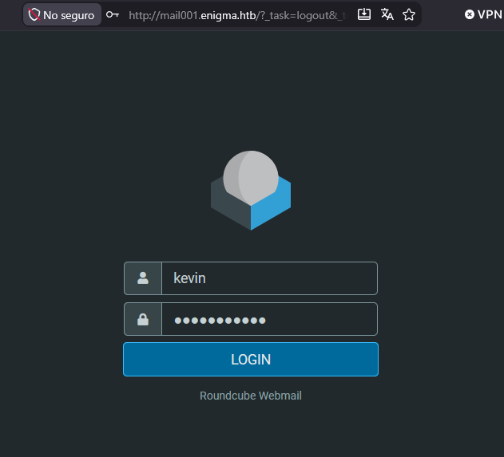
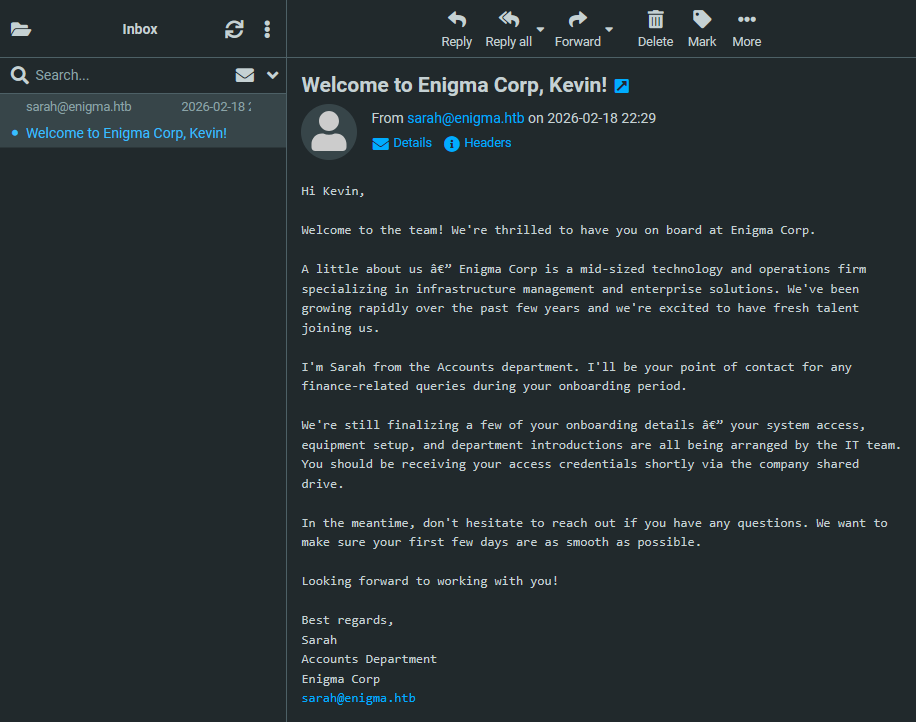

``` bash

ip="10.129.92.129"

```


``` bash

❯ recon $ip
Starting Nmap 7.98 ( https://nmap.org ) at 2026-09-09 17:36 +0200
Nmap scan report for 10.129.92.129
Host is up (0.038s latency).
Not shown: 65522 closed tcp ports (reset)
PORT      STATE SERVICE
22/tcp    open  ssh
80/tcp    open  http
110/tcp   open  pop3
111/tcp   open  rpcbind
143/tcp   open  imap
993/tcp   open  imaps
995/tcp   open  pop3s
2049/tcp  open  nfs
32785/tcp open  unknown
33819/tcp open  unknown
42869/tcp open  unknown
46737/tcp open  unknown
60349/tcp open  unknown

Nmap done: 1 IP address (1 host up) scanned in 13.13 seconds
[*] First script done
[*] Open ports = '22,80,110,111,143,993,995,2049,32785,33819,42869,46737,60349'
Starting Nmap 7.98 ( https://nmap.org ) at 2026-09-09 17:37 +0200
Nmap scan report for 10.129.92.129
Host is up (0.037s latency).

PORT      STATE SERVICE  VERSION
22/tcp    open  ssh      OpenSSH 9.6p1 Ubuntu 3ubuntu13.16 (Ubuntu Linux; protocol 2.0)
| ssh-hostkey:
|   256 0c:4b:d2:76:ab:10:06:92:05:dc:f7:55:94:7f:18:df (ECDSA)
|_  256 2d:6d:4a:4c:ee:2e:11:b6:c8:90:e6:83:e9:df:38:b0 (ED25519)
80/tcp    open  http     nginx 1.24.0 (Ubuntu)
|_http-server-header: nginx/1.24.0 (Ubuntu)
|_http-title: Did not follow redirect to http://enigma.htb/
110/tcp   open  pop3     Dovecot pop3d
|_ssl-date: TLS randomness does not represent time
|_pop3-capabilities: UIDL CAPA STLS AUTH-RESP-CODE SASL RESP-CODES TOP PIPELINING
| ssl-cert: Subject: commonName=enigma
| Subject Alternative Name: DNS:enigma
| Not valid before: 2026-02-18T20:33:33
|_Not valid after:  2036-02-16T20:33:33
111/tcp   open  rpcbind  2-4 (RPC #100000)
| rpcinfo:
|   program version    port/proto  service
|   100000  2,3,4        111/tcp   rpcbind
|   100000  2,3,4        111/udp   rpcbind
|   100000  3,4          111/tcp6  rpcbind
|   100000  3,4          111/udp6  rpcbind
|   100003  3,4         2049/tcp   nfs
|   100003  3,4         2049/tcp6  nfs
|   100005  1,2,3      49597/udp   mountd
|   100005  1,2,3      53207/tcp6  mountd
|   100005  1,2,3      53505/udp6  mountd
|   100005  1,2,3      60349/tcp   mountd
|   100021  1,3,4      38997/tcp6  nlockmgr
|   100021  1,3,4      45914/udp   nlockmgr
|   100021  1,3,4      46737/tcp   nlockmgr
|   100021  1,3,4      51002/udp6  nlockmgr
|   100024  1          32785/tcp   status
|   100024  1          33792/udp   status
|   100024  1          34529/tcp6  status
|   100024  1          58413/udp6  status
|   100227  3           2049/tcp   nfs_acl
|_  100227  3           2049/tcp6  nfs_acl
143/tcp   open  imap     Dovecot imapd (Ubuntu)
|_ssl-date: TLS randomness does not represent time
| ssl-cert: Subject: commonName=enigma
| Subject Alternative Name: DNS:enigma
| Not valid before: 2026-02-18T20:33:33
|_Not valid after:  2036-02-16T20:33:33
|_imap-capabilities: IDLE LOGINDISABLEDA0001 have post-login listed capabilities SASL-IR Pre-login OK LITERAL+ more LOGIN-REFERRALS STARTTLS IMAP4rev1 ENABLE ID
993/tcp   open  ssl/imap Dovecot imapd (Ubuntu)
| ssl-cert: Subject: commonName=enigma
| Subject Alternative Name: DNS:enigma
| Not valid before: 2026-02-18T20:33:33
|_Not valid after:  2036-02-16T20:33:33
|_imap-capabilities: IDLE Pre-login AUTH=PLAINA0001 have post-login SASL-IR listed capabilities LITERAL+ more OK LOGIN-REFERRALS IMAP4rev1 ENABLE ID
|_ssl-date: TLS randomness does not represent time
995/tcp   open  ssl/pop3 Dovecot pop3d
| ssl-cert: Subject: commonName=enigma
| Subject Alternative Name: DNS:enigma
| Not valid before: 2026-02-18T20:33:33
|_Not valid after:  2036-02-16T20:33:33
|_ssl-date: TLS randomness does not represent time
|_pop3-capabilities: UIDL CAPA AUTH-RESP-CODE USER SASL(PLAIN) RESP-CODES TOP PIPELINING
2049/tcp  open  nfs_acl  3 (RPC #100227)
32785/tcp open  status   1 (RPC #100024)
33819/tcp open  mountd   1-3 (RPC #100005)
42869/tcp open  mountd   1-3 (RPC #100005)
46737/tcp open  nlockmgr 1-4 (RPC #100021)
60349/tcp open  mountd   1-3 (RPC #100005)
Service Info: OS: Linux; CPE: cpe:/o:linux:linux_kernel

Service detection performed. Please report any incorrect results at https://nmap.org/submit/ .
Nmap done: 1 IP address (1 host up) scanned in 16.88 seconds
[*] Done
╭─ ~/hacking/ctf/htb/easy/enigma/recon                                                                       ✔ │ 36s ─╮
╰─                                                                                                                   ─╯

```

``` bash

❯ echo "$ip enigma.htb" | sudo tee -a /etc/hosts
10.129.92.129 enigma.htb
╭─ ~/hacking/ctf/htb/easy/enigma/recon                                                                             ✔ ─╮
╰─                                                                                                                   ─╯

```


``` bash

❯ showmount -e $ip
Export list for 10.129.92.129:
/srv/nfs/onboarding *
❯ mkdir /tmp/nfs_local
❯ sudo mount -t nfs $ip://srv/nfs/onboarding /tmp/nfs_local
[sudo] password for joel:
╭─ ~/hacking/ctf/htb/easy/enigma/recon                                                                        ✔ │ 5s ─╮
╰─                                                                                                                   ─╯

```


``` bash


❯ pwd
/tmp/nfs_local
❯ ls
New_Employee_Access.pdf
╭─ ∅ /tmp/nfs_local                                                                                                ✔ ─╮
╰─                                                                                                                   ─╯


```


[New_Employee_Access.pdf](./New_Employee_Access.pdf)


``` bash

❯ cat password.txt
kevin
Enigma2024!

```


``` bash

❯ ffuf -u http://enigma.htb/ -w /usr/share/seclists/Discovery/DNS/subdomains-top1million-110000.txt -H "Host: FUZZ.enigma.htb" -fs 154

        /'___\  /'___\           /'___\
       /\ \__/ /\ \__/  __  __  /\ \__/
       \ \ ,__\\ \ ,__\/\ \/\ \ \ \ ,__\
        \ \ \_/ \ \ \_/\ \ \_\ \ \ \ \_/
         \ \_\   \ \_\  \ \____/  \ \_\
          \/_/    \/_/   \/___/    \/_/

       v2.1.0-dev
________________________________________________

 :: Method           : GET
 :: URL              : http://enigma.htb/
 :: Wordlist         : FUZZ: /usr/share/seclists/Discovery/DNS/subdomains-top1million-110000.txt
 :: Header           : Host: FUZZ.enigma.htb
 :: Follow redirects : false
 :: Calibration      : false
 :: Timeout          : 10
 :: Threads          : 40
 :: Matcher          : Response status: 200-299,301,302,307,401,403,405,500
 :: Filter           : Response size: 154
________________________________________________

mail001                 [Status: 200, Size: 5327, Words: 366, Lines: 97, Duration: 758ms]
:: Progress: [48356/114442] :: Job [1/1] :: 1117 req/sec :: Duration: [0:00:45] :: Errors: 0 ::


```


``` bash

❯ echo "$ip mail001.enigma.htb" | sudo tee -a /etc/hosts
10.129.92.129 mail001.enigma.htb
╭─ ~/hacking/ctf/htb/easy/enigma/recon                                                                             ✔ ─╮
╰─                                                                                                                   ─╯

```





